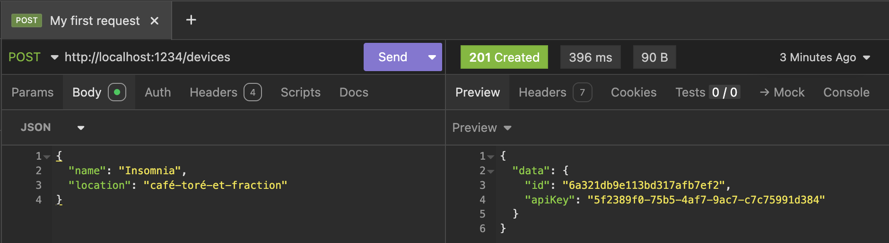
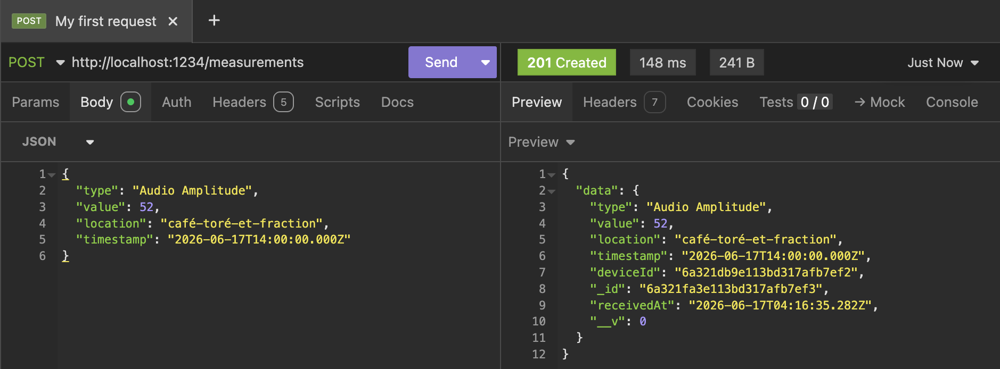
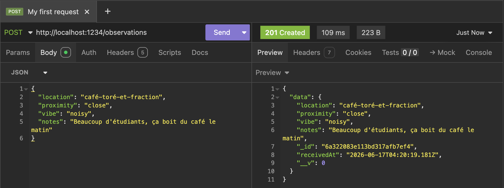
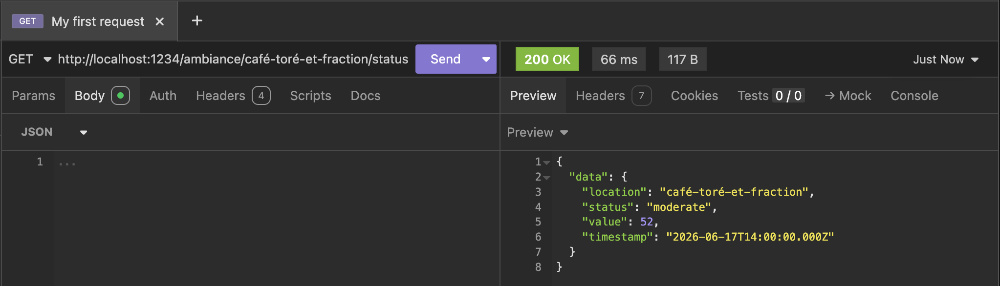
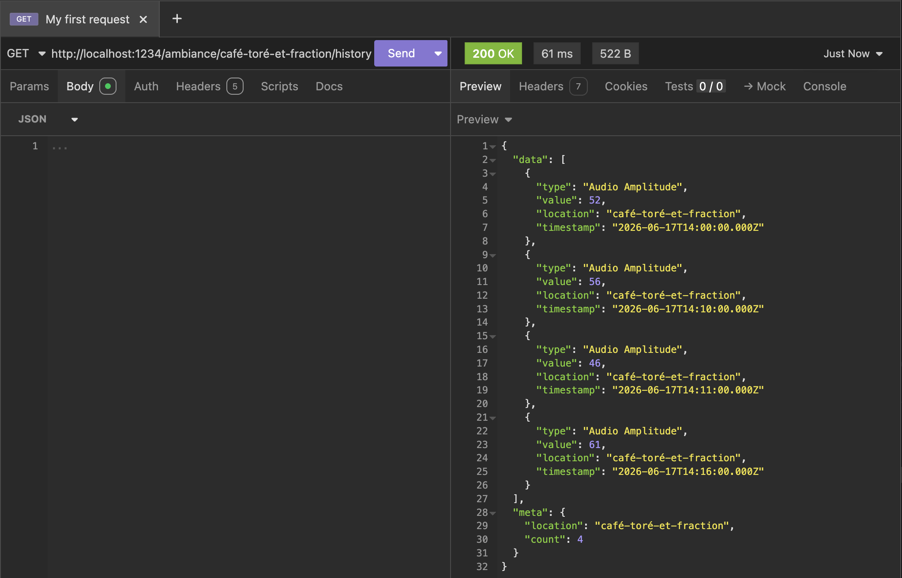

<h1 align="center">AmbiSense</h1>

<p align="center">
  Serveur Express connecté à MongoDB Atlas qui collecte et expose des données d'ambiance (niveau sonore, observations) en quasi temps réel via une API REST authentifiée par clé API.
</p>

---

## Prérequis

- Node.js v18+
- Un cluster MongoDB Atlas
- Phyphox (application mobile pour la collecte audio)

---

## Installation

```bash
git clone https://github.com/anasys0x/AmbiSense.git
cd AmbiSense
npm install
```

Crée un fichier `.env` à la racine (voir `.env.example`) :

```env
MONGO_URI=mongodb+srv://<username>:<password>@<cluster>.mongodb.net/<dbname>?appName=AmbiSense
PORT=3000
REMOTE_ACCESS=http://<ip-du-telephone>
API_KEY=<api-key-generee-par-POST-/devices>
```

Lance le serveur :

```bash
npm run dev     # développement (nodemon)
npm start       # production
```

Lance le bridge (dans un terminal séparé) :

```bash
npm run bridge
```

---

## Endpoints

### Gestion des devices

| Méthode | Endpoint | Header | Corps | Réponse |
|---------|----------|--------|-------|---------|
| `POST` | `/devices` | — | `{ name, location }` | `201 + { data: { id, apiKey } }` |
| `GET` | `/devices` | — | — | `200 + { data: [...], meta: { count } }` |
| `GET` | `/devices/me` | `x-api-key` | — | `200 + { data: { id, name, location } }` |

### Collecte

| Méthode | Endpoint | Header | Corps | Réponse |
|---------|----------|--------|-------|---------|
| `POST` | `/measurements` | `x-api-key` | `{ type, value, location, timestamp }` | `201 + { data: document }` |
| `POST` | `/observations` | `x-api-key` | `{ location, proximity, vibe, notes }` | `201 + { data: document }` |

### Sémantiques

| Méthode | Endpoint | Description |
|---------|----------|-------------|
| `GET` | `/ambiance/:location/status` | Dernière mesure et classification de l'ambiance |
| `GET` | `/ambiance/:location/history?last=3h` | Évolution des mesures sur une période |
| `GET` | `/ambiance/:location/quiet-hours` | Créneaux typiquement calmes par heure de la journée |
| `GET` | `/ambiance/:location/vibe` | Vibe dominante issue des observations humaines |

> Les routes `POST /measurements`, `POST /observations` et `GET /devices/me` requièrent un header `x-api-key` valide.  
> `POST /devices` est public et permet d'obtenir une clé API, ça ne nécessite pas d'authentification.

---

## Authentification

1. Enregistre ton device : `POST /devices { name, location }`
2. Récupère l'`apiKey` dans la réponse
3. Inclus-la dans chaque requête protégée : `x-api-key: <ta-clé>`

---

## Données de test (seed)

Pour remplir la base avec un jeu de données de démonstration (sans avoir à brancher Phyphox), un script de seed est disponible :

```bash
npm run seed
```

Il crée :
- **1 device** de test (`Seed Phone` à `biblio_jb`) et affiche son `apiKey` dans la console ;
- **96 mesures** réparties sur les 24 heures (sur 2 jours), avec des valeurs réalistes : calme la nuit, bruyant en journée ;
- **3 observations** de démonstration.

> Le script nettoie d'abord ses propres données précédentes (device `Seed Phone` et observations marquées `[SEED]`) avant de réinsérer : il est donc relançable sans créer de doublons.
> Récupère l'`apiKey` affichée à la fin pour tester les routes protégées par `x-api-key`.

Une fois la base remplie, les routes d'ambiance deviennent directement testables, par exemple :

```
GET /ambiance/biblio_jb/quiet-hours
```

---

## Test avec Insomnia

### 1. Créer un device
`POST http://localhost:1234/devices`
```json
{ "name": "Insomnia", "location": "café-toré-et-fraction" }
```


Récupère l'`apiKey` dans la réponse, tu en auras besoin pour les étapes suivantes.

### 2. Envoyer une mesure
`POST http://localhost:1234/measurements`  
Header : `x-api-key: <ta-clé>`

```json

{
  "type": "Audio Amplitude",
  "value": 52,
  "location": "café-toré-et-fraction",
  "timestamp": "2026-06-17T14:00:00.000Z"
}
```

> [!NOTE]
> N'OUBLIEZ PAS DE PLACER LA CLÉ API DANS LE HEADER (x-api-key)
### 3. Envoyer une observation
`POST http://localhost:1234/observations`  
Header : `x-api-key: <ta-clé>`
```json
{
  "location": "café-toré-et-fraction",
  "proximity": "close",
  "vibe": "noisy",
  "notes": "Beaucoup d'étudiants, période d'examens"
}
```



### 4. Consulter l'ambiance

#### Status
`GET http://localhost:1234/ambiance/café-toré-et-fraction/status`



#### History
`GET http://localhost:1234/ambiance/café-toré-et-fraction/history?last=3`



#### Quiet-hours
`GET http://localhost:1234/ambiance/biblio_jb/quiet-hours`

```json
{
  "data": [
    { "hour": 3, "averageValue": 32.5, "ambiance": "quiet", "count": 4 },
    { "hour": 14, "averageValue": 61.2, "ambiance": "moderate", "count": 12 }
  ],
  "meta": {
    "location": "biblio_jb",
    "count": 96,
    "quietest": { "hour": 3, "averageValue": 32.5, "ambiance": "quiet", "count": 4 }
  }
}
```

#### Vibe
`GET http://localhost:1234/ambiance/café-toré-et-fraction/vibe`

```json
{
  "data": {
    "location": "café-toré-et-fraction",
    "dominantVibe": "noisy",
    "dominantProximity": "close",
    "lastNote": "match de foot, ambiance très animée"
  },
  "meta": { "basedOn": 10 }
}
```

---


## Bridge Phyphox

Le bridge est un script autonome qui collecte les données audio depuis Phyphox et les envoie automatiquement au serveur toutes les 5 secondes.

Au démarrage, il :
1. Récupère le type de mesure depuis `REMOTE_ACCESS/config`
2. Récupère la location du device depuis `GET /devices/me`
3. Lance la collecte en boucle (chaque 5 secondes)

---

## Structure du projet

```
src/
├── bridge/
│   └── bridge.js
├── middlewares/
│   └── auth.js
├── models/
│   ├── Device.js
│   ├── Measurement.js
│   └── Observation.js
├── routes/
│   ├── ambiance.js
│   ├── devices.js
│   ├── measurements.js
│   └── observations.js
├── services/
│   └── mongoose.js
├── screenshots
│   └──...png
└── index.js
```

---

## IFT3225 — Phase 1
